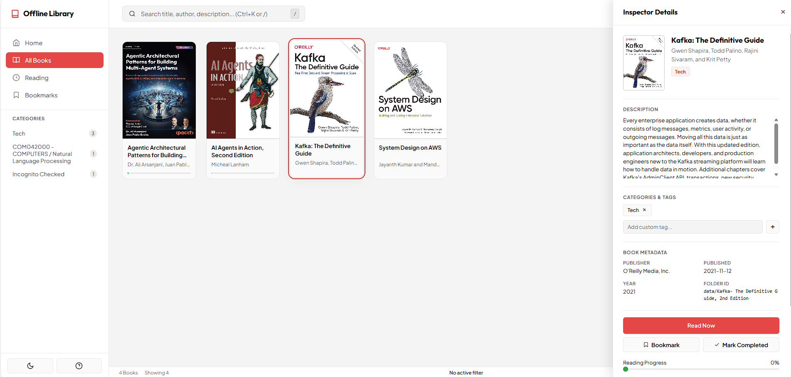
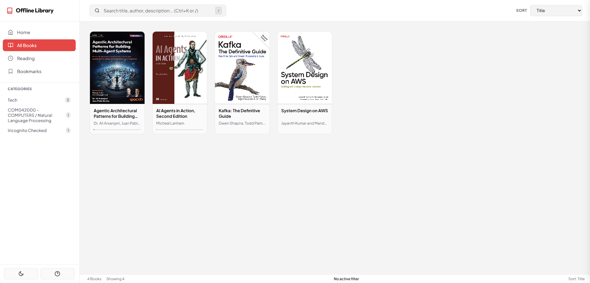
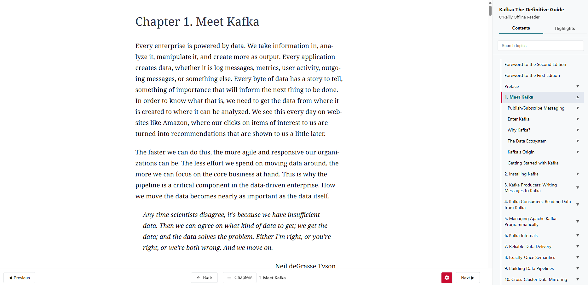

# O'Reilly Offline Downloader & Library

A powerful, high-performance Python CLI for downloading **O'Reilly
Learning** courses, books, and audiobooks for offline personal use. It
supports video courses, EPUB generation, audiobook downloads,
interactive web readers, transcripts, and a premium offline library
dashboard.

> **Architecture:** The project is built as a modern Python package
> managed with **uv**, providing fast dependency management, clean
> installation, and cross-platform support.

------------------------------------------------------------------------

# ✨ Features

## Downloading

-   Download complete O'Reilly video courses
-   Download audiobooks as high-quality `.m4a`
-   Download books as standard `.epub`
-   Generate interactive offline HTML web readers
-   Extract timestamped video transcripts
-   Transcripts-only mode for fast text extraction

## Offline Library

-   Premium Apple Books-inspired dashboard
-   Automatic library indexing
-   Fast search
-   Reading progress
-   Persistent custom tags
-   Keyboard navigation
-   Dark & Light themes
-   Automatic cover image detection

## Downloader Engine

-   API-first resolver
-   Selenium fallback
-   Manual login mode
-   Persistent browser profiles
-   Parallel downloads
-   Dead Letter Queue logging
-   Detailed debug logging

------------------------------------------------------------------------

# 🚀 Quick Start

## Requirements

-   Python 3.11+
-   uv
-   ffmpeg

### Install uv

``` bash
# Windows
powershell -ExecutionPolicy ByPass -c "irm https://astral.sh/uv/install.ps1 | iex"

# Linux/macOS
curl -LsSf https://astral.sh/uv/install.sh | sh
```

### Install ffmpeg

``` bash
# Windows
choco install ffmpeg

# macOS
brew install ffmpeg

# Ubuntu/Debian
sudo apt install ffmpeg
```

------------------------------------------------------------------------

# Usage

## Download a Course

``` bash
uv run oreilly-dl "COURSE_URL"
```

## Download an EPUB

``` bash
uv run oreilly-dl "BOOK_URL"
```

## Download with Interactive Web Reader

``` bash
uv run oreilly-dl "BOOK_URL" --web-viewer
```

Books downloaded using `--web-viewer` are automatically registered
inside the Offline Library Dashboard.

## Download an Audiobook

``` bash
uv run oreilly-dl "AUDIOBOOK_URL" --audiobook
```

## Transcripts Only

``` bash
uv run oreilly-dl "COURSE_URL" --transcripts-only
```

## Manual Login

``` bash
uv run oreilly-dl --manual-login
```

------------------------------------------------------------------------

# 🏛️ Offline Library Dashboard

The Offline Library Dashboard provides a centralized interface for
browsing, organizing, and reading downloaded books.

### 📸 Screenshot Gallery

**Unified Library Dashboard**



**Metadata Inspector Drawer**



**Interactive Local eBook Reader**



## Features

-   Apple Books-inspired design
-   Fast search
-   Metadata inspector
-   Custom tag editing
-   Keyboard shortcuts
-   Responsive layout
-   Automatic cover detection

## Keyboard Shortcuts

  Key           Action
  ------------- -------------------------
  ↑ / ↓         Navigate books
  Space         Toggle details drawer
  Enter         Open reader
  / or Ctrl+K   Focus search
  ?             Show keyboard shortcuts

## 🚀 Launching the Offline Library

After downloading one or more books with the `--web-viewer` option, the
Offline Library Dashboard is generated under:

``` text
downloads/
└── books/
    ├── data/
    ├── index.html
    ├── library_state.json
    ├── serve_library.py
    ├── start_library.bat
    └── start_library.sh
```

To start the local library server:

-   **Windows:** Double-click `start_library.bat`
-   **Linux/macOS:** Run `./start_library.sh`

The launcher starts a lightweight local web server and automatically
opens the Offline Library Dashboard in your default browser.

> **Note:** The dashboard is generated for books downloaded using the
> `--web-viewer` option.

------------------------------------------------------------------------

# 📁 Output Structure

``` text
downloads/
├── books/
│   ├── data/                    # Downloaded EPUBs & Web Reader assets
│   ├── index.html               # Offline Library Dashboard
│   ├── library_state.json       # Library metadata & custom tags
│   ├── serve_library.py         # Local HTTP server
│   ├── start_library.bat        # Windows launcher
│   └── start_library.sh         # Linux/macOS launcher
├── courses/                     # Video & audio course downloads
└── audiobooks/                  # Audiobook downloads (.m4a)
```

The launcher scripts provide the easiest way to start the Offline
Library Dashboard:

-   **Windows:** `start_library.bat`
-   **Linux/macOS:** `./start_library.sh`

------------------------------------------------------------------------

# 🧪 Running Tests

``` bash
uv run pytest
```

------------------------------------------------------------------------

# ⚙️ Command Line Help

``` bash
uv run oreilly-dl --help
```

------------------------------------------------------------------------

# 🔧 Troubleshooting

## Authentication Issues

``` bash
uv run oreilly-dl --manual-login
```

## Video Download Issues

Verify that `ffmpeg` is installed and available in your system `PATH`.

## Debug Logging

``` bash
uv run oreilly-dl "COURSE_URL" --debug
```

------------------------------------------------------------------------

# ⚠️ Disclaimer

This project is intended for **educational purposes and personal offline
archiving**. Users are responsible for complying with O'Reilly Media's
Terms of Service and applicable copyright laws.

------------------------------------------------------------------------

# 📄 License

MIT License.
